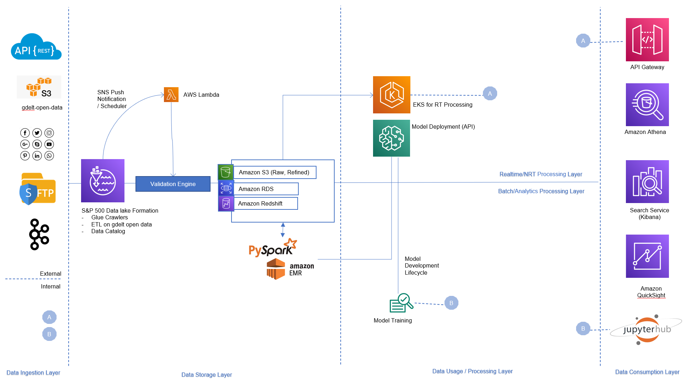
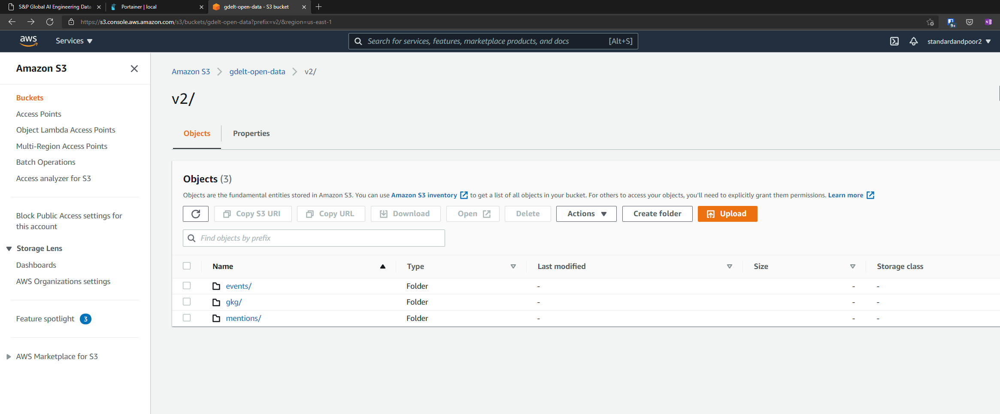
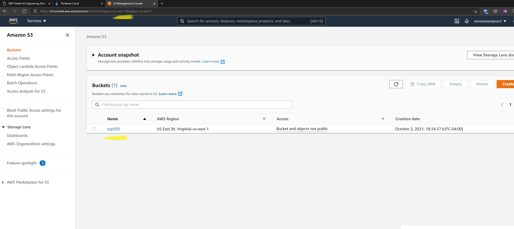
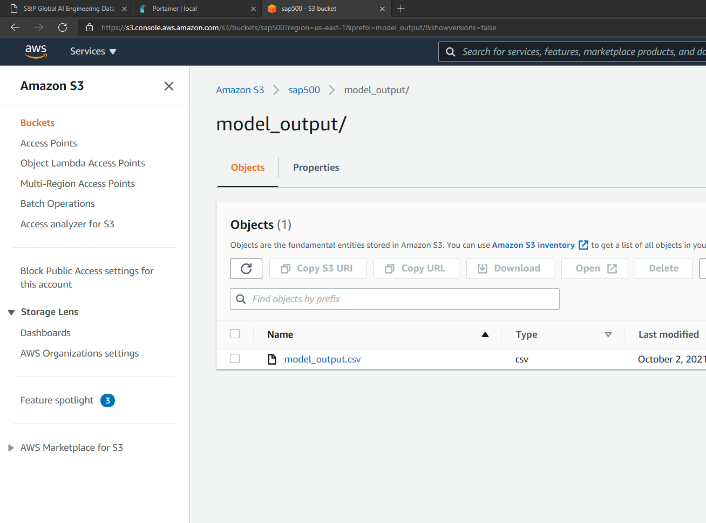
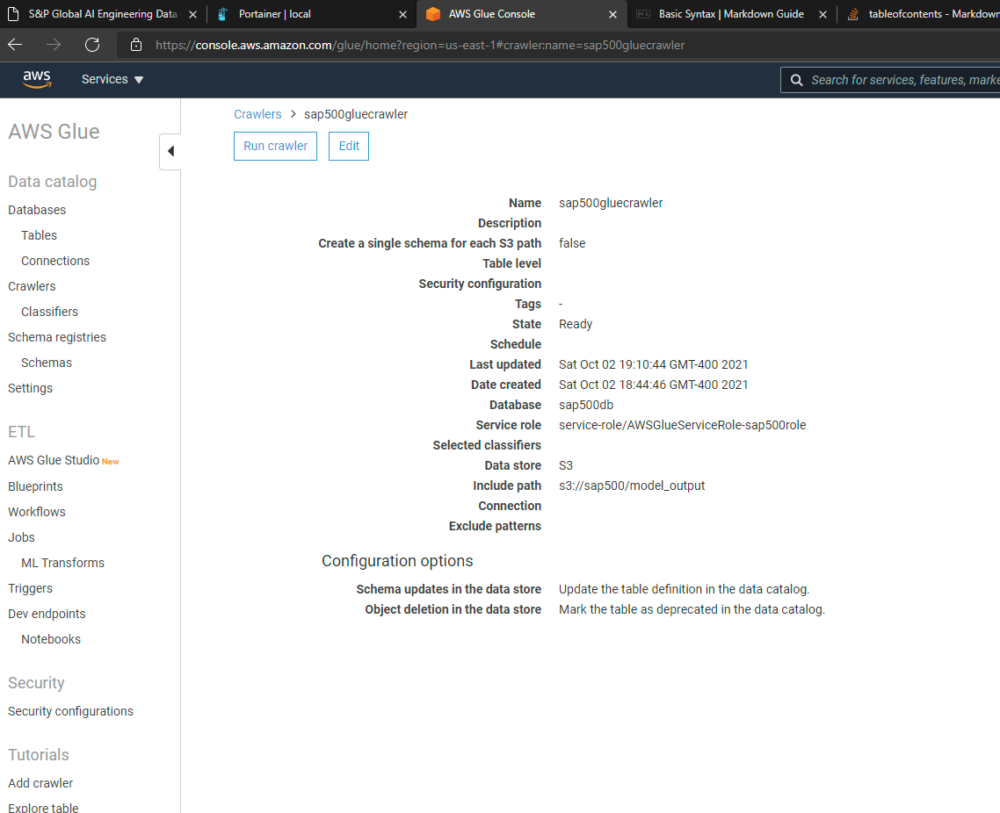
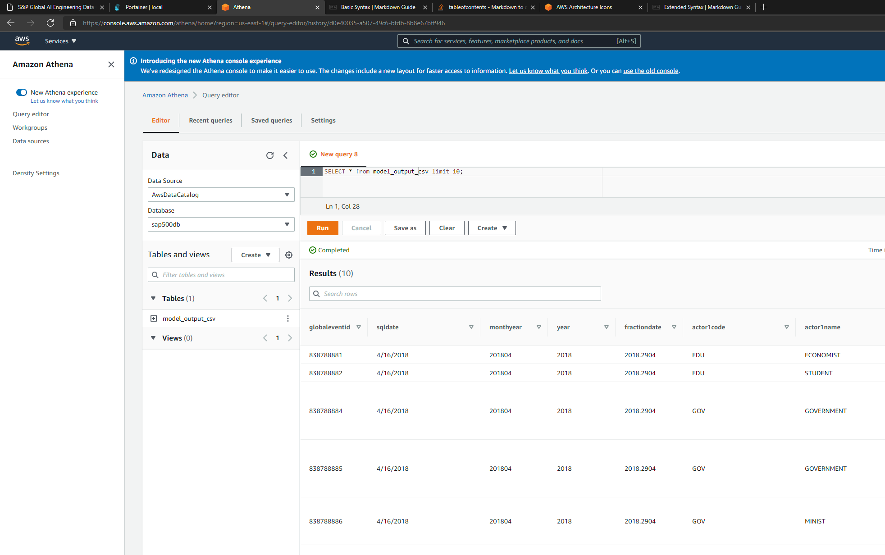

# ReadMe

## Observations and notes
1. S3 bucket from Gdelt has data only till 2019. So did not implement Lambda trigger to run on push notification
2. GDELT mentions and GKG events seem information rich, did not explore yet
3. Since data files from GDELT at not huge, around ~1500 records per 15 minute run, Pandas based processing will be sufficient. 
4. To perform any historical analysis, say infer model output from beginning of time on new version of the model, a PySpark implementation is preferred
5. Also to join across different data sources for batch analytics like Bloomberg data, Wikipedia etc - distributed frameworks are well suited. 
6. Since S&P500 is primarily a data company, the architecture has a construct of Data Lake Formation template, where Data catalog can be managed through Glue Crawlers. Entitlement management in Producer, Consumer and Central-Lake accounts are not shown. 
7. MDLC - model training, model artifact management and model promotion / deployment is assumed to be done through components in SageMaker

## Todo
1. Finetune the cache implementation, implement politeness to API call
2. Architecture representation in [C4 model](https://c4model.com/)
3. Current solution is implemented using [Portainer](https://www.portainer.io/) and [PySpark docker](https://hub.docker.com/r/jupyter/pyspark-notebook). Document dockerfile and docker run commands.
4. Implement Tableau / QuickSight dashboard to interact with data 
5. Incorporate Non Functional Requirements: Resiliency, Security, Encryption, Access Control into the design

## Architecture Draft


## Files in the folder
|#|Filename|Description|
|--|---|---|
|1|1_generate_prediction.ipynb| File with Python/Pyspark/Pandas code to read from Gdelt and call Model API hosted|
|2|2_run_report.ipynb| Jupyter notebook to understand data distributions to create QuickSight dashboards later|
|3|headers.csv|V2 events header information - about 61 columns with description|
|4|model_output.*|Parquet and CSV formats of normalized model output after calling the API for Actor1 and Actor2|
|5|SystemDesign.pptx|PowerPoint with high level documentation|

## AWS Screenshots
- Created a dummy gmail account for this purpose. Use this if interested. 

### S3 Gdelt-open-data


### S3 Standard-and-Poor bucket


### S3 Standard-and-Poor Model-Output


### S3 Standard-and-Poor Glue


### S3 Standard-and-Poor Athena


### Athena Create Table Query 
```
    CREATE EXTERNAL TABLE `model_output_csv`(
    `globaleventid` bigint, 
    `sqldate` string, 
    `monthyear` bigint, 
    `year` bigint, 
    `fractiondate` double, 
    `actor1code` string, 
    `actor1name` string, 
    `actor1countrycode` string, 
    `actor1knowngroupcode` string, 
    `actor1ethniccode` string, 
    `actor1religion1code` string, 
    `actor1religion2code` string, 
    `actor1type1code` string, 
    `actor1type2code` string, 
    `actor1type3code` string, 
    `actor2code` string, 
    `actor2name` string, 
    `actor2countrycode` string, 
    `actor2knowngroupcode` string, 
    `actor2ethniccode` string, 
    `actor2religion1code` string, 
    `actor2religion2code` string, 
    `actor2type1code` string, 
    `actor2type2code` string, 
    `actor2type3code` string, 
    `isrootevent` bigint, 
    `eventcode` bigint, 
    `eventbasecode` bigint, 
    `eventrootcode` bigint, 
    `quadclass` bigint, 
    `goldsteinscale` double, 
    `nummentions` bigint, 
    `numsources` bigint, 
    `numarticles` bigint, 
    `avgtone` double, 
    `actor1geo_type` bigint, 
    `actor1geo_fullname` string, 
    `actor1geo_countrycode` string, 
    `actor1geo_adm1code` string, 
    `actor1geo_adm2code` string, 
    `actor1geo_lat` double, 
    `actor1geo_long` double, 
    `actor1geo_featureid` string, 
    `actor2geo_type` bigint, 
    `actor2geo_fullname` string, 
    `actor2geo_countrycode` string, 
    `actor2geo_adm1code` string, 
    `actor2geo_adm2code` string, 
    `actor2geo_lat` double, 
    `actor2geo_long` double, 
    `actor2geo_featureid` string, 
    `actiongeo_type` bigint, 
    `actiongeo_fullname` string, 
    `actiongeo_countrycode` string, 
    `actiongeo_adm1code` string, 
    `actiongeo_adm2code` string, 
    `actiongeo_lat` double, 
    `actiongeo_long` double, 
    `actiongeo_featureid` string, 
    `dateadded` string, 
    `sourceurl` string, 
    `actor1__model_time_in_ms` bigint, 
    `actor1_release_harness_version` double, 
    `actor1_release_model_version` string, 
    `actor1_release_model_version_number` bigint, 
    `actor1_request_id` string, 
    `actor1_result_class1` boolean, 
    `actor1_result_class2` bigint, 
    `actor1_timing` double, 
    `actor2__model_time_in_ms` bigint, 
    `actor2_release_harness_version` double, 
    `actor2_release_model_version` string, 
    `actor2_release_model_version_number` bigint, 
    `actor2_request_id` string, 
    `actor2_result_class1` boolean, 
    `actor2_result_class2` bigint, 
    `actor2_timing` double)
    ROW FORMAT DELIMITED 
    FIELDS TERMINATED BY ',' 
    STORED AS INPUTFORMAT 
    'org.apache.hadoop.mapred.TextInputFormat' 
    OUTPUTFORMAT 
    'org.apache.hadoop.hive.ql.io.HiveIgnoreKeyTextOutputFormat'
    LOCATION
    's3://sap500/model_output.csv'
    TBLPROPERTIES (
    'CrawlerSchemaDeserializerVersion'='1.0', 
    'CrawlerSchemaSerializerVersion'='1.0', 
    'UPDATED_BY_CRAWLER'='sap500gluecrawler', 
    'areColumnsQuoted'='false', 
    'averageRecordSize'='807', 
    'classification'='csv', 
    'columnsOrdered'='true', 
    'compressionType'='none', 
    'delimiter'=',', 
    'objectCount'='1', 
    'recordCount'='776', 
    'sizeKey'='626633', 
    'skip.header.line.count'='1', 
    'typeOfData'='file')
```
